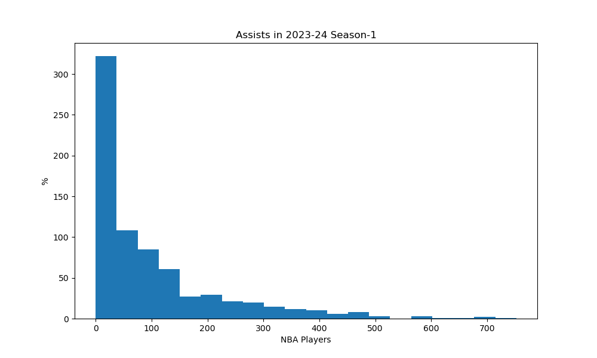

Describe:
statistic,Rk,Player,Pos,Age,Tm,G,GS,MP,FG,FGA,FG%,3P,3PA,3P%,2P,2PA,2P%,eFG%,FT,FTA,FT%,ORB,DRB,TRB,AST,STL,BLK,TOV,PF,PTS,Player-additional
count,735.0,735,735,735.0,735,735.0,735.0,735.0,735.0,735.0,727.0,735.0,735.0,689.0,735.0,735.0,722.0,727.0,735.0,735.0,676.0,735.0,735.0,735.0,735.0,735.0,735.0,735.0,735.0,735.0,735
null_count,0.0,0,0,0.0,0,0.0,0.0,0.0,0.0,0.0,8.0,0.0,0.0,46.0,0.0,0.0,13.0,8.0,0.0,0.0,59.0,0.0,0.0,0.0,0.0,0.0,0.0,0.0,0.0,0.0,0
mean,282.20952380952383,,,26.155102040816328,,40.880272108843535,18.440816326530612,907.7578231292517,156.15238095238095,330.6965986394558,0.44755845942228334,48.01360544217687,131.82448979591837,0.31692452830188683,108.13877551020408,198.8721088435374,0.5196855955678669,0.5156918844566712,62.585034013605444,79.91700680272109,0.7496701183431953,39.398639455782316,122.62721088435374,162.02585034013606,99.86530612244898,28.16734693877551,19.08707482993197,48.01904761904762,70.58367346938776,422.9034013605442,
std,166.8589025783879,,,4.3717445447135725,,25.5812927631774,25.02410760018355,809.4986783236825,173.94999490259315,358.16085494221466,0.11070100490456063,59.12608178807201,154.30696943536455,0.13721714074542,133.6266191975671,240.1321502040554,0.13681339544664206,0.11473747122537278,88.22624214462529,109.34166346720338,0.16003048522722177,47.78961897808041,132.13600383408078,174.10161972322385,124.65415734967988,27.00379467547815,26.705795103552365,53.4040907786873,61.72332796739068,475.8143630605133,
min,1.0,A.J. Green,C,19.0,ATL,1.0,0.0,1.0,0.0,0.0,0.0,0.0,0.0,0.0,0.0,0.0,0.0,0.0,0.0,0.0,0.0,0.0,0.0,0.0,0.0,0.0,0.0,0.0,0.0,0.0,achiupr01
25%,141.0,,,23.0,,17.0,0.0,161.0,19.0,49.0,0.4,2.0,10.0,0.28,13.0,26.0,0.478,0.483,6.0,9.0,0.686,7.0,19.0,28.0,13.0,5.0,3.0,7.0,15.0,52.0,
50%,290.0,,,25.0,,41.0,5.0,680.0,88.0,201.0,0.446,22.0,69.0,0.346,55.0,107.0,0.53,0.529,28.0,39.0,0.778,23.0,82.0,113.0,54.0,20.0,9.0,30.0,56.0,244.0,
75%,424.0,,,29.0,,65.0,29.0,1529.0,236.0,497.0,0.5,77.0,210.0,0.385,150.0,272.0,0.581,0.575,79.0,104.0,0.84,54.0,184.0,242.0,130.0,44.0,27.0,69.0,113.0,626.0,
max,572.0,Zion Williamson,SG-PG,39.0,WAS,84.0,82.0,2989.0,837.0,1652.0,0.8,357.0,876.0,1.0,803.0,1245.0,1.0,0.917,567.0,782.0,1.0,335.0,826.0,1120.0,752.0,150.0,254.0,282.0,254.0,2370.0,zubaciv0
Summarize:
mean,median,stdev
99.86530612244898,54.0,124.65415734967988
n

n

